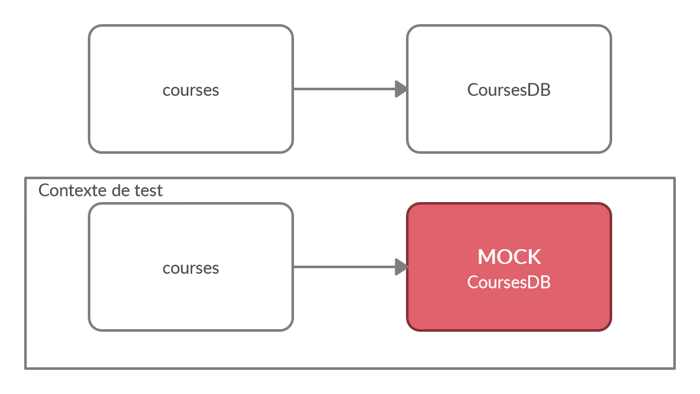

# Mocks dans les tests

Lorsqu'on écrit des tests unitaires, on veut compartimentaliser le bout de code qu'on tests pour qu'il ne soit pas affecté par aucune autre partie du système. On veut aussi que notre code ne cré pas d'états différents ou de changements à son tour dans le système. Écrire dans la BD (ou demander à un autre module d'écrire dans la BD) est un bon exemple de chose qu'on souhaite éviter.

C'est ici que les `mocks` entrent en jeu. On va employer le terme "mock" ou "mocker quelque chose" pour désigner un morceau de code **qui est utilisé par** le code testé, auquel on va retirer son comportement dans le contexte du test.



Les mocks sont très utiles! Ils nous permettent de:

- Empècher le comportement du module appelé
  - Et même de le modifier
- Espionner le comportement du module testé envers le module appelé

## Utilisation avec jest

Les mocks font partie de Jest, on a donc rien a installer ou même importer.

### Les mock functions

Les [mock functions](https://jestjs.io/docs/en/mock-functions) sont un moyen de créer une fonction "de toute pièce" qui pourra être passée en argument à notre module testé. On peut en définir le comportement et en espionner l'usage.

On crée une fonction mock avec `jest.fn()`

```javascript
//fichier.js
const maFonction = (uneAutreFonction) => {
  uneAutreFonction();
};

export default maFonction;
```

```javascript
//fichier.test.js
import maFonctionTeste from "./fichier.js";

const uneAutreFonctionMock = jest.fn();

describe("maFonction", () => {
  it("should call uneAutreFonction", () => {
    maFonction(uneAutreFonctionMock);
    expect(uneAutreFonctionMock).toHaveBeenCalled();
  });
});
```

### mocks de modules

Nous voulons aussi pouvoir mocker des dépendences provenant de `import`. voir la [documentation](https://jestjs.io/docs/en/es6-class-mocks) pour plus d'exemples et d'autres manières de faire. Nous priorisons le mock automatique et par factory dans le cours.

```javascript
//dependence.js
export default () => {
  // Manipulation dans la BD ...
};
```

```javascript
//fichier.js
import dependence from "./dependence.js";

export default () => {
  return dependence();
};
```

```javascript
//fichier.test.js
import dependence from "./dependence.js";
import maFonctionTeste from "./fichier.js";

jest.mock("./dependence.js");

describe("maFonction", () => {
  it("should call dependence", () => {
    maFonctionTeste();
    expect(dependence).toHaveBeenCalled();
  });
});
```

### Tests sur les mocks

Une trappe des mocks est qu'ils ont un état interne (state). C'est utile à l'intérieur du même test pour faire l'appel de fonctions puis tester l'état du mock ensuite. C'est cependant nuisible d'un test à l'autre, car le mock va retenir son état et tous ses appels de fonction entre les tests. Pour empêcher cet effet de bord, on peut "clear" le mock entre chaque tests en utiliser le `beforeEach()` de jest.

```javascript
import dependence from "./dependence.js";
import maFonctionTeste from "./fichier.js";
jest.mock("./dependence.js");

beforeEach(() => {
  dependence.mockClear();
});

describe("maFonction", () => {
  it("should call dependence only once", async () => {
    maFonctionTeste();
    expect(dependence).toHaveBeenCalledTimes(1);
  });
  it("should call dependence only once still", async () => {
    maFonctionTeste();
    expect(dependence).toHaveBeenCalledTimes(1);
  });
});
```

Voici aussi quelques exemples d'utilisation des mocks...

```javascript
import dependence from "./dependence.js";
import maFonctionTeste from "./fichier.js";
jest.mock("./dependence.js");

beforeEach(() => {
  dependence.mockClear();
});

describe("maFonction", () => {
  it("should call dependence", async () => {
    maFonctionTeste();
    expect(dependence).toHaveBeenCalledTimes(1);
  });
  it("should call dependence with", async () => {
    maFonctionTeste();
    expect(dependence).toHaveBeenCalledWith("abc");
    expect(dependence).toHaveBeenCalledWith({ def: 123 });
    expect(dependence.mock.calls.length).toBe(2);
    expect(dependence.mock.calls[0][0]).toBe("abc");
    expect(dependence.mock.calls[1][0]).toEqual({ def: 123 });
  });
});
```

Vous voyez dans ce test qu'en plus des matchers applicables sur un mock; `toHaveBeenCalled`, `toHaveBeenCalledWith` et autres, le mock expose une membre `mock`, qui a par exemple une liste de `calls` qui garde une liste des arguments de chacun de ces appels. Voir la [documentation](https://jestjs.io/docs/en/mock-functions) pour plus d'exemples.

### Modification de l'implémentation d'une fonction mockée

Dans le cas ou le code testé fait appel à un module mocké mais en attend une réponse, il nous est possible de définir un comportement alternatif, et donc la réponse attendue.

```javascript
//fichier.js
import dependence from "./dependence.js";

export default () => {
  return dependence();
};
```

```javascript
//fichier.test.js
import dependence from "./dependence.js";
import maFonctionTeste from "./fichier.js";

jest.mock("./dependence.js", () => {
  return jest.fn(() => {
    return 456;
  });
});

describe("maFonction", () => {
  it("should call dependence", async () => {
    const actual = maFonctionTeste();

    expect(dependence).toHaveBeenCalledTimes(1);
    expect(actual).toBe(456);
  });
});

//CONSOLE:
//  456
```

Cependant, une telle manière de faire aura le désavantage de supprimer le comportement si on clear le mock avec `mockClear()`. Il est alors possible de le définir dans le beforeEach, ou même carrément dans chacune des fonctions de tests, avec `mockImplementation(() => {})`.

Par exemple, si on voulait mocker le comportement de notre base de données de brousse, nous pourrions faire;

```javascript
import coursesDB from "./coursesDB.js";
import { getCourses, addCourse, removeCourse } from "./courses.js";

jest.mock("./coursesDB.js");

beforeEach(() => {
  coursesDB.get.mockClear();
  coursesDB.set.mockClear();
  coursesDB.get.mockImplementation(() => {
    return [
      {
        id: 1,
        nom: "Architecture web",
      },
    ];
  });
});

describe("courses", () => {
  describe("get", () => {
    it("should contain correct elements", async () => {
      const list = await getCourses();
      expect(list[0]).toEqual({
        id: 1,
        nom: "Architecture web",
      });
    });
    it("should contain correct number of elements", async () => {
      const list = await getCourses();
      expect(list.length).toBe(1);
    });
  });
```

Et là, notre bout de code est bien compartimentalisé. Peu importe le contenu de la vrai base de données, le test va toujours se comporter de la même manière, et la vie est belle!
